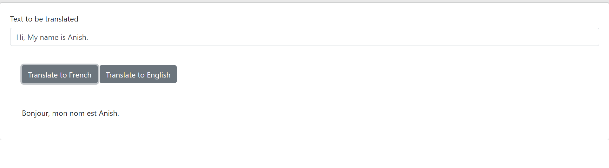
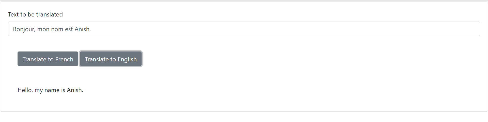

# Developing of a Langauage Translator (French to English and vice) (IBM-COURSERA)

## Table of Contents

- [Overview](#overview)
  - [The Scenario](#scenario)
  - [The Task](#tasks)
  - [Screenshot](#screenshot)
  - [Technical Skills](#technical-skills)
  - [Frameworks, Platforms, Libraries](#frameworks,-platforms,-libraries)
  - [Version Control](#version-control)
  - [Cloud](#cloud)
  - [Browsers](#browsers)
  - [IDEs/Editors](#ides/editors)
  - [Acknoledgement](#Acknowledgement)
- [Author](#author)
  - [Connect With Me](#connect-with-me)
  - [Github Stats](#github-stats)

## Overview

### Scenario

In the scenario, I will build the functionality on top of a given skeleton structure to develop a server with end points that allow to translate from English to French and from French to English.

### Tasks

- Write a function that translates English text to French in translator.py
- Write the unit tests for English to French translator and French to English translator function in tests.py
- Check your code against python coding standards
- Run tests
- Package the above functions and tests as a standard python package.
- Import the package into server.py and create flask end points
- Run the server

### Screenshot

### Technical Skills

 

### Frameworks, Platforms, Libraries

 

### Operating System

 

### Cloud

<kbd></kbd>

<kbd></kbd>

### Version Control

### Browsers

 

### IDEs/Editors

 

### Acknowledgement

## Authors

### Connect With Me

 
 

### GitHub Stats

